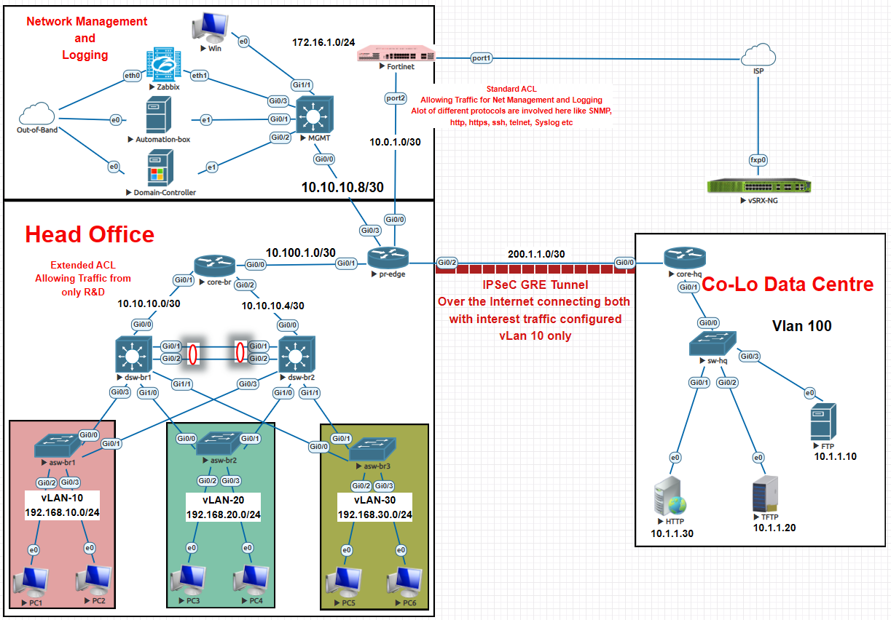

# Enterprise Infrastructure Lab

## Overview

- CCNA-focused enterprise network built in a lab environment
- Models a Head Office connected to a Co-location Data Centre
- Designed to explain networking concepts using a working topology
- Each component reflects real enterprise design decisions

## Topology Summary

- Segmented Head Office network using VLANs
- Dedicated Management and Monitoring network
- Core, Distribution, and Access layer separation
- Fortinet firewall handling NAT and traffic control
- GRE over IPsec tunnel connecting to Data Centre
- Centralized services hosted in Data Centre

## Network Segmentation

### Head Office VLANs

- VLAN 10 → 192.168.10.0/24 (R&D)
- VLAN 20 → 192.168.20.0/24
- VLAN 30 → 192.168.30.0/24
- Each VLAN operates as an independent broadcast domain
- Inter-VLAN communication controlled via Layer 3 routing and ACLs

### Data Centre

- VLAN 100 → 10.1.1.0/24
- Dedicated to hosting internal services
- Logically isolated from user networks

## Architecture

### Access Layer

- Connects end devices
- Operates at Layer 2
- Handles VLAN assignment and switching

### Distribution Layer

- Aggregates access layer traffic
- Performs inter-VLAN routing using SVIs
- Acts as policy enforcement point

### Core Layer

- Provides fast and reliable internal routing
- Connects distribution layer to edge

### Edge

- Connects enterprise network to external networks
- Handles NAT, WAN connectivity, and tunnel termination

## WAN Connectivity

- /30 addressing used for point-to-point links
- Efficient IP utilization
- GRE tunnel established between Head Office and Data Centre
- IPsec used to encrypt traffic over WAN

## Access Control

### Standard ACL

- Applied to management network
- Allows SNMP, SSH, HTTP, HTTPS, Syslog
- Controls access to network devices

### Extended ACL

- Enforces data plane policy
- Only VLAN 10 (R&D) allowed to access Data Centre
- Filters based on source, destination, and protocol

## Security

- NAT implemented at firewall
- Traffic filtering using ACLs
- IPsec encryption across WAN
- Management network isolated from production

## Services

- HTTP Server → 10.1.1.30
- FTP Server → 10.1.1.10
- FTP Server → 10.1.1.20
- Access controlled through defined policies

## Monitoring and Management

- Zabbix for monitoring
- SNMP and Syslog for visibility and logging
- Out-of-band network for management access

## Traffic Flow Example

- User in VLAN 10 sends request to Data Centre
- Traffic forwarded to default gateway (SVI)
- Routed through distribution and core
- ACL permits VLAN 10 traffic
- Traffic enters GRE tunnel
- Encrypted using IPsec
- Traverses ISP network
- Decrypted at Data Centre
- Delivered to destination server

## Capabilities Implemented

- VLAN segmentation and subnetting
- Inter-VLAN routing using Layer 3 switching
- Dynamic routing with OSPF
- First Hop Redundancy using HSRP
- Standard and Extended ACLs
- NAT and firewall enforcement
- GRE over IPsec tunneling
- WAN design using /30 addressing
- Network services (DNS, DHCP, HTTP, FTP)
- Monitoring and logging (SNMP, Syslog, Zabbix)
- Structured device management

## Design Position

- Full enterprise-style lab environment
- Demonstrates interaction between networking concepts
- Implements segmentation, security, and redundancy
- Reflects real-world network behavior

## Repository Structure

- 00-introduction
- 01-network-foundation
- 02-security
- 03-routing
- 04-services
- 05-wan
- 06-observability
- assets

## Purpose

- Explain CCNA concepts using a practical lab
- Demonstrate enterprise network design principles
- Provide structured documentation for learning and reference